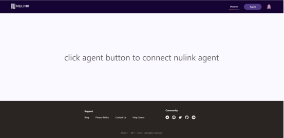
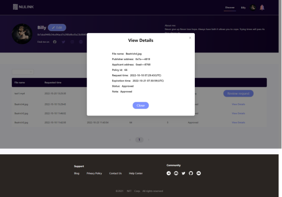

# 概述
NuLink 文件共享 Dapp 是数据共享用户管理私有文件和处理授权请求的入口。[在此处](https://filetransfer.nulink.org/)访问 NuLink 文件共享 Dapp。
***
# 初始化：连接代理登录
在使用 NuLink 文件共享 Dapp 之前，请点击代理按钮连接 NuLink-agent。如何注册和使用 NuLink-agent 请[参考此链接](https://docs.nulink.org/products/nulink_agent)。  
  
连接后，用户可以访问 NuLink 文件共享 Dapp。它包括三个页面：发现页面、用户中心页面和通知页面。
***
# 发现页面
单击发现按钮以访问发现页面。在此页面中，用户可以查看和搜索在 NuLink 网络中上传的文件。  
  
发现页面支持以下功能： 选择“哲学”、“图像”等标签过滤文件；按文件名或部分文件名搜索或模糊搜索；按上传时间排序文件（从最新到最旧/从最旧到最新）。  
  
每个文件显示文件名、所有者信息和马赛克图。单击它以查看更多详细信息。文件详细信息页面显示各种信息，包括：图像、文件名、数据所有者的头像和昵称、IPFS 文件地址。  
  
单击“请求此文件”将应用程序发送给文件所有者。点击按钮后会弹出一个窗口，输入申请天数，点击“提交”即可成功提交申请。  
  
如果文件所有者没有批准申请，申请人再次进入详情页面时将始终显示“待处理”状态：  
  
数据所有者完成批准后，申请人可以进入此详细信息页面并下载文件：  
  
***
# 用户中心
单击名称/头像缩略图按钮以访问用户中心页面。在此页面中，用户可以查看个人信息，包括头像缩略图、昵称、钱包地址和个人资料。用户中心页面还将显示“我的文件”、“已发送请求”、“传入请求”和“我的策略”。  
   
点击“编辑”按钮编辑个人信息。填写或更改昵称、用户网站、Twitter/Instagram/Facebook 和个人资料。点击调用本地文件路径，选择图片替换头像缩略图。单击“保存”按钮保存更改。  
  
***
# 我的文件
我的文件页面列出了用户上传的所有文件，文件显示信息包括缩略图、文件名、用户名和头像。  
  
***
# 发送请求
已发送请求页面列出了用户已发送的所有请求。检查此页面上每个请求的状态。状态包括已批准、待定、已拒绝。用户可以根据这些状态过滤请求。  
  
单击“查看详细信息”以查看有关请求的更多信息。  
  
对于已批准状态的文件，单击“下载”按钮将其下载到本地。
***
# 传入请求
Incoming requests 页面列出了用户收到的所有请求。在此页面查看每个请求的状态并进行处理。状态还包括已批准、待定、已拒绝。  
  
对于处于 Approved 或 Rejected 状态的请求，单击“查看详细信息”按钮可查看详细信息，包括文件名、所有者地址、策略 ID、请求时间、到期时间和状态。  
  
对于处于Pending 状态的文件需要进行“Review request”操作。点击同意意见后，选择“是”表示同意，选择“否”表示拒绝。如果用户选择“是”，则会弹出一个窗口，调用NuLink-agent支付 Gas 费。支付成功后，请求将被批准，如下图所示：
  
***
# 我的策略
我的策略页面主要展示用户关联策略的信息，查看策略有两种角色： 第一个角色是作为发布者：作为创建和上传文件的角色，当发布者通过其他用户的请求时，会生成一个policy id，“As Publisher”页面会显示关联的文件和对应的已授权的policy id顺利出局。  
  
单击“查看文件”以访问文件并查看更多信息。  
  
第二个角色是作为申请人：作为文件的请求者，当申请人的请求被批准时，会生成一个对应的策略ID。在作为申请人页面上查看所有请求的文件，包括文件名、策略 ID 和发布者地址，并通过单击“查看文件”按钮将所有这些文件下载到本地而无需重复请求。  
  
单击“查看文件”以访问文件并查看更多信息。  
  
***
# 通知页面
点击右上角的铃铛图案，进入通知页面。此页面显示用户收到的所有系统消息。单击查看详细信息按钮以进一步处理这些消息。  
  
通知主要有五种类型：申请、创建策略、拒绝、批准和自动批准：申请意味着用户已收到申请；Create Policy 表示策略创建成功；Rejected/Approved 表示用户申请被数据所有者拒绝/批准；自动批准是指用户再次申请了批准的政策对应的文件，系统会自动批准。